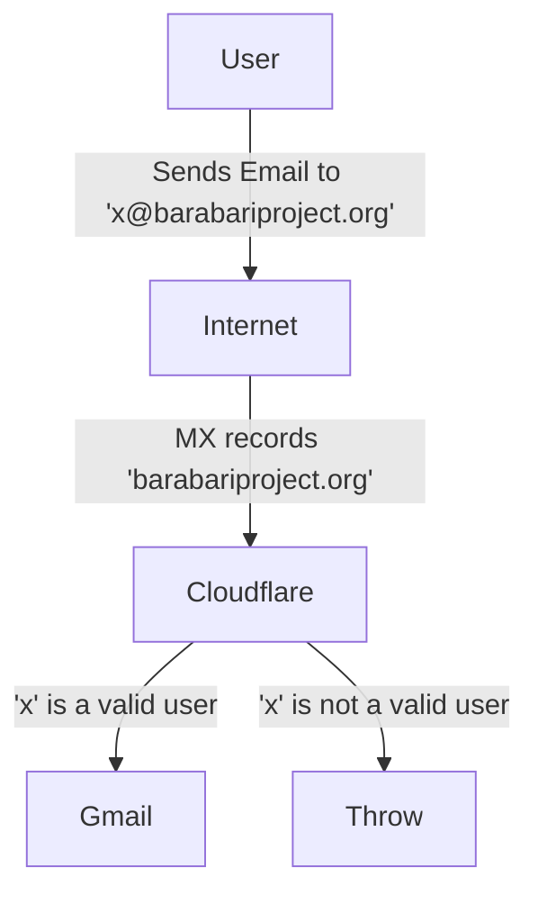
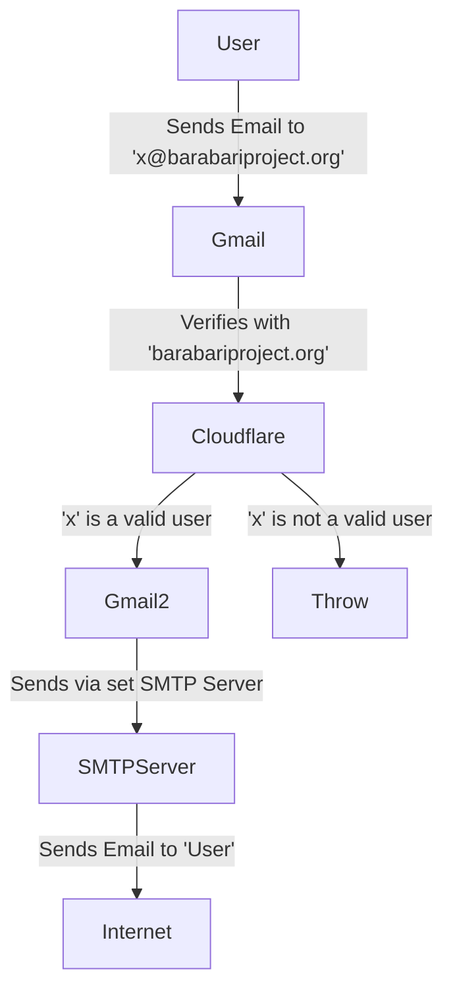

## Email Routing

### TO Barabari

ADDING a new user to routing
- Go to Cloudflare console
- Click on `barabariproject.org`
- Click on `Email Routing`
- Go to `Routing Rules` tab
- Add a new rule

REMOVING a new user to routing
- Go to Cloudflare console
- Click on `barabariproject.org`
- Click on `Email Routing`
- Go to `Routing Rules` tab
- Click on `edit` for the user
- Click on `Delete`

For more see [Cloudflare Email Routing](https://developers.cloudflare.com/email-routing/)

### FROM Barabari

- Go to https://mail.google.com/mail/u/3/#settings/accounts
- Click add another email address
- Add name and email address
- **UN**select `Treat as an alias` (next)
- Next
- - SMTP Server: `smtp.gmail.com`
- - Username is normal barabariproject@gmail email
- - Password is APP PASSWORD For gmail (generated earlier)
- Follow rest of steps and complete

### First time setups
- [Cloudflare](https://www.youtube.com/watch?v=nNGcvz1Sc_8)
- [Gmail](https://community.cloudflare.com/t/solved-how-to-use-gmail-smtp-to-send-from-an-email-address-which-uses-cloudflare-email-routing/382769)